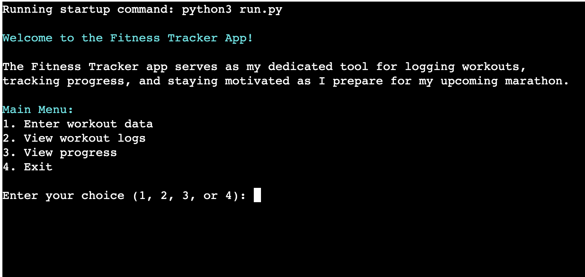
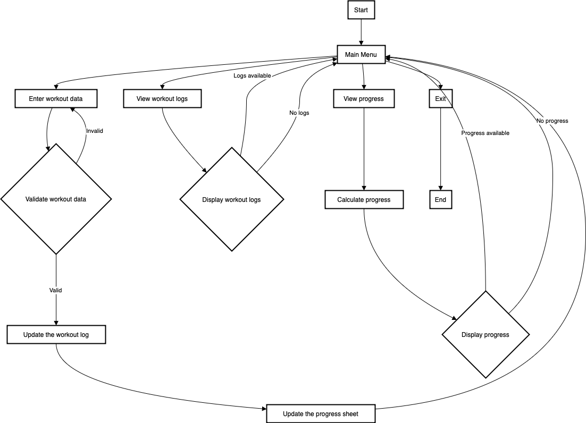
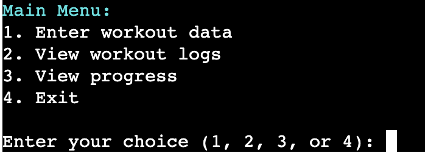
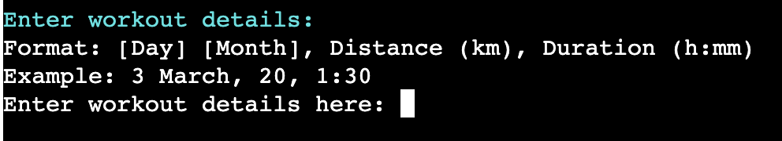
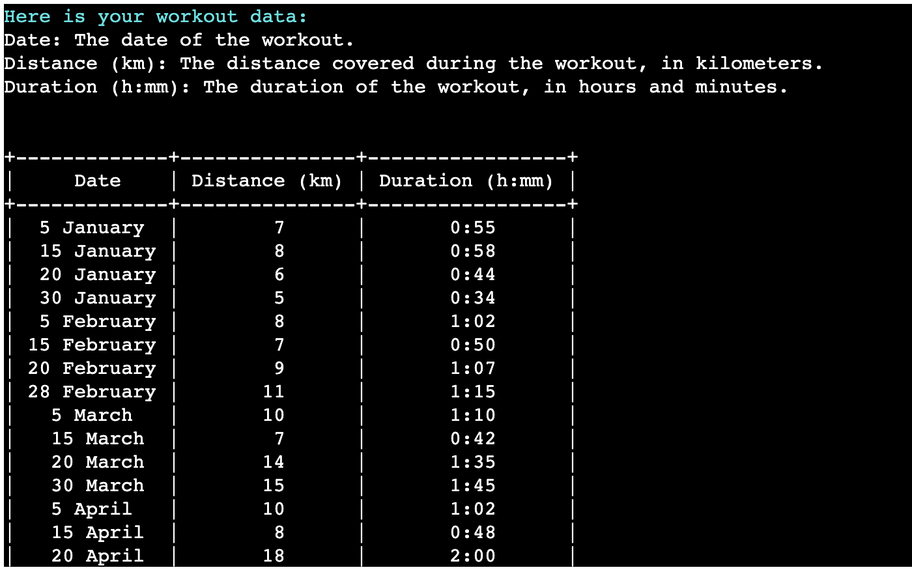
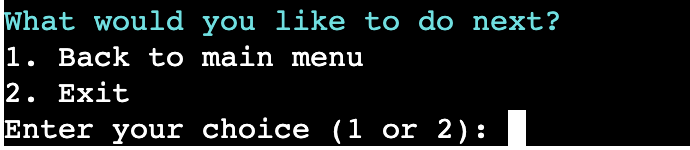
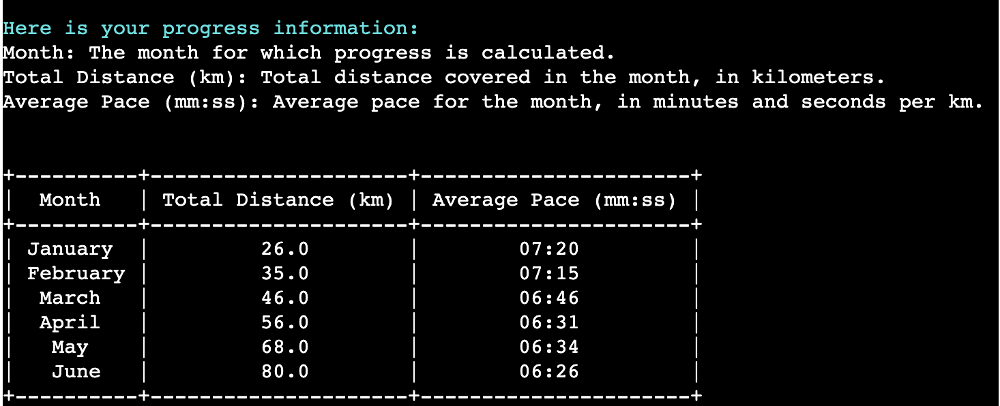
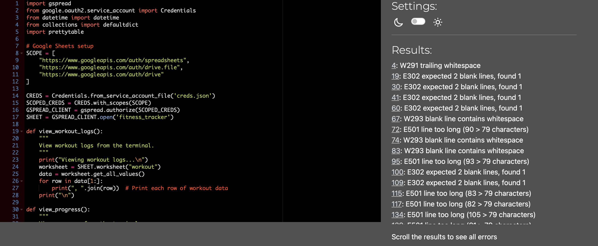

# Fitness Tracker

The Fitness Tracker app is a personalized application designed to streamline my marathon training journey. Developed with simplicity and functionality in mind, this tracker serves as my dedicated tool for logging workouts, tracking progress, and staying motivated as I prepare for my upcoming marathon.

Visit the deployed application [here](https://marathon-tracker-3c8498abb267.herokuapp.com/).

## Table of Contents
1. [User Experience (UX)](#user-experience-UX)
    1. [Project Goals](#project-goals)
    2. [User Stories](#user-stories)
    3. [Color Scheme](#color-scheme)
    4. [Data Model](#data-model)
    5. [Flowchart](#flowchart)
2. [Features](#features)
    1. [Main Menu](main-menu)
    2. [Enter Workout Data](#enter-workout-data)
    3. [View Workout Logs](#view-workout)
    4. [View Progress](#view-progress)
    5. [Exit Program](#exit-program)
3. [Technologies Used](#technologies-used)
    1. [Language Used](#language-used)
    2. [Frameworks, Libraries and Programs Used](#frameworks-libraries-and-programs-used)
4. [Testing](#testing)
    1. [Testing User Stories](#testing-user-stories)
    2. [Code Validation](#code-validation)
    3. [Manual Testing](#manual-testing)
5. [Deployment](#deployment)
6. [Credits](#credits)
7. [Acknowledgements](#acknowledgements)

***

## User Experience (UX)

### Project Goals

* Clarity and accessibility - present the tracker in a clear and understandable manner.

* Intuitive workflow - design each step of the tracker to be intuitive and straightforward.

* Input validation - implement robust input validation mechanisms to ensure accurate and error-free data entry.

* Continuous operation - log workouts and view progress at any time until I choose to exit the application.

### User Stories

* As a user, I want to understand the main objective of the program clearly to know its purpose.

* As a user, I want to easily understand what input is needed on each step.

* As a user, I want to receive clear feedback in case I provide the wrong input.

* As a user, I want the workouts and progress to be presented clearly.

### Color Scheme

Colorama has been used to apply color to the terminal text, to make the program more intuitive and easier to read.

* Light cyan is used for headings and prompts in the terminal.

* Green is used for indicating success or valid input.

* Red is used for indicating errors or invalid input.

### Data Model

#### Google Sheets Integration

The application interacts with Google Sheets to store workout logs and progress data. Data is stored in a tabular format, with each row representing a workout log or progress entry.

#### Worksheet Structure

My Google Sheets document contains two worksheets: one for storing workout logs and another for tracking progress. Each worksheet has columns for different attributes such as date, distance, duration, and calculated fields like total distance and average pace.

#### Workout Log Data

Each workout log entry consists of data such as the workout date, distance covered (in kilometers), and duration (in hours and minutes).

#### Progress Data

Progress data is calculated based on the accumulated workout logs. It includes metrics such as total distance covered and average pace for each month.

#### Data Validation

The application includes functions to validate input data to ensure it conforms to expected formats and criteria. For example, validating workout dates, distances, and durations.

#### User Interaction

Users interact with the application through a terminal interface, providing input for entering workout data, viewing logs, and tracking progress.

#### Data Processing

Data processing functions are included to handle tasks such as calculating progress, formatting data for display, and updating the Google Sheets document with new entries or progress updates.

### Flowchart

The following flowchart was designed using draw.io in order to plan the logic to be implemented in the program.

[Back to top ⇧](#fitness-tracker)

## Features

### Main Menu

* Users are presented with a main menu displaying different options.

* Users can input their choice (1, 2, 3, or 4) to navigate through the program.

### Enter Workout Data

Users can enter workout details including the date, distance (in kilometers), and duration (in hours and minutes).

### View Workout Logs

#### Structured Display

* Users can view their workout logs directly from the terminal.

* Workout logs are displayed in a structured format including the date, distance, and duration of each workout.

#### Navigation Options

Users can choose to go back to the main menu or exit the program after viewing workout logs.

### View Progress

#### Structured Display

* Users can view their progress directly from the terminal.

* Progress is displayed in a structured format including the month, total distance and average pace. 

* Progress data is automatically calculated based on the workout data collected.

* This allows users to monitor their progress over time, including total distance covered per month and average pace per month.

#### Navigation Options

Users can choose to go back to the main menu or exit the program after viewing progress.

### Exit Program

A confirmation message is displayed before exiting the program, ensuring users intend to exit.

### Future Features

Delete or update tables. 

[Back to top ⇧](#fitness-tracker)

## Technologies Used

### Language Used

* [Python3](https://en.wikipedia.org/wiki/Python_(programming_language))

### Frameworks, Libraries and Programs Used

* [GitPod](https://gitpod.io/) was used for writing code, committing, and then pushing to GitHub.

* [GitHub](https://github.com/) was used to store the project after pushing.

* [Heroku](https://id.heroku.com/) was used to deploy the application.

* [PEP8 online check](http://pep8online.com/) was used to validate the Python code.

* [PrettyTable](https://pypi.org/project/prettytable/) library was used to present the data in table format.

* [Colorama](https://pypi.org/project/colorama/) library was used to apply color to the terminal text. 

* [draw.io](https://www.drawio.com) was used to create the program flowchart.

[Back to top ⇧](#macro-calculator)

## Testing

### Testing User Stories

* As a user, I want to understand the main objective of the program clearly to know its purpose.

   - Details about the purpose of the fitness tracker application are presented in the welcome message, providing an overview of how the application is intended to be used.

* As a user, I want to easily understand what input is needed on each step.

   - Input prompts are displayed in light green text, clearly indicating the required input from the user.
   
   - Detailed information is provided alongside the input prompts, explaining the format and type of data expected from the user.

* As a user, I want to receive clear feedback in case I provide the wrong input.

   - Error messages are prominently displayed in red, clearly indicating when incorrect input is provided.

   - Error messages explain the issue with the input provided, helping the user understand what went wrong and how to correct it.

* As a user, I want the workouts and progress to be presented clearly.

   - Workouts and progress are displayed in a clear and visually appealing manner, utilizing a table format to enhance clarity.

### Code Validation

[PEP8 online check](https://pep8ci.herokuapp.com/#) was used during the development process to validate the Python code for PEP8 requirements.

Here's a summary of the errors:

* **W291:** Trailing whitespace: There are trailing whitespaces at the end of lines. These should be removed.

* **E302:** Expected 2 blank lines, found 1: This error occurs when there is only one blank line between two sections where two blank lines are expected. You should add an extra blank line where required.

* **W293:** Blank line contains whitespace: This error indicates that there are whitespaces on blank lines, which should be removed.

* **E501:** Line too long: Lines are exceeding the recommended maximum length of 79 characters. Consider breaking them into multiple lines to improve readability.

* **E305:** Expected 2 blank lines after class or function definition, found 1: Similar to E302, this error occurs when there's only one blank line where two are expected, specifically after class or function definitions.

* **W292:** No newline at end of file: This warning suggests adding a newline at the end of the file, which is a common convention.

### Manual Testing

#### Workout Date Format

<table>
    <tr>
        <th>Feature</th>
        <th>Outcome</th>
        <th>Example</th>
        <th>Pass/Fail</th>
    </tr>
    <tr>
        <td rowspan=2>Menu Format</td>
        <td>Validates that input for the main menu choice is one of the valid options: 1, 2, 3, or 4.</td>
        <td></td>
        <td>Pass</td>
    </tr>
        <td>Validates that input for the submenu choice is one of the valid options: 1 or 2</td>
        <td></td>
        <td>Pass</td>
    </tr>   
    <tr>
        <td rowspan=2>Data Entry Values</td>
        <td>Validates that exactly 3 values have been entered correctly each workout: day, month, distance, and duration.</td>
        <td></td>
        <td>Pass</td>
    </tr>
        <td>Validates that exactly 3 values have been not been entered correclty.</td>
        <td></td>
        <td>Pass</td>
    </tr>
    <tr>
        <td>Workout Date Format</td>
        <td>Validates the workout date format (Day Month).</td>
        <td></td>
        <td>Pass</td>
    <tr>
        <td>Distance Validation</td>
        <td>Validates that the distance entered is a positive number.</td>
        <td></td>
        <td>Pass</td>
    <tr>
        <td rowspan=4>Duration Format</td>
        <td>Validates that the duration follows the format "h:mm" (hours:minutes).</td>
        <td></td>
        <td>Pass</td>
    </tr>
        <td>Validates that the hours are between 0 and 9 (inclusive).</td>
        <td></td>
        <td>Pass</td>
    </tr>
    </tr>
        <td>Validates that the minutes are between 0 and 59.</td>
        <td></td>
        <td>Pass</td>
    </tr>
    </tr>
        <td>Validates that the minutes are in a 2-digit format.</td>
        <td></td>
        <td>Pass</td>
    </tr>
</table>

[Back to top ⇧](#fitness-tracker)

## Deployment

The application has been deployed using [Heroku](https://id.heroku.com/) by following these steps:

[Heroku](https://id.heroku.com/) was used to deploy the application.

1. Create the requirements.txt file and run: `pip3 freeze > requirements.txt` in the console.
2. Commit changes and push them to GitHub.
3. Go to the Heroku's website.
4. From the Heroku dashboard, click on "Create new app".
5. Enter the "App name" and "Choose a region" before clicking on "Create app".
6. Go to "Config Vars" under the "Settings" tab.
7. Click on "Reveals Config Vars" and add the KEY: CREDS and the VALUE stored in creds.json file if needed.
8. Add the Config Var, KEY: PORT and VALUE: 8000.
9. Go to "Buildpacks" section and click "Add buildpack".
10. Select "python" and click "Save changes"
11. Add "nodejs" buildpack as well using the same process.
12. Go to "Deployment method", under the "Deploy" tab select "GitHub" and click on "Connect to GitHub".
13. Go to "Connect to GitHub" section and "Search" the repository to be deployed.
14. Click "Connect" next the repository name.
15. Choose "Automatic deploys" or "Manual deploys" to deploy your application.

[Back to top ⇧](#fitness-tracker)

## Credits

### Content

### Code
* [Stack Overflow](https://stackoverflow.com/) was consulted on a regular basis for inspiration and sometimes to be able to better understand the code being implemented.

[Back to top ⇧](#fitness-tracker)

## Acknowledgements